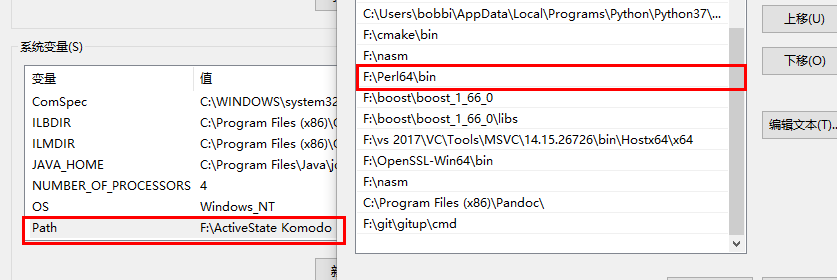

#<center>win10环境下编译方式配置openssl</center>
<center>zzw经过反复尝试的实测安装openssl打开方式</center>
<font size=4 face="楷体">
    <br/>&#160;&#160;&#160;&#160;最近在配置openssl环境，网上一大堆的教程都不一样，并且很多已经不适合openssl的现在情况下的配置。网上的直接安装的openssl的做法很简单，但在使用代码的时候会缺少库libeay32.lib 和ssleay32.lib等一系列的lib库而不能真正运行最后的给出的代码。经过一周的摸索与亲自的实践，现在把整个配置环境的做法张贴上来，以供参考。（编译完成的code也已经放到github上供直接下载）
    <br/>&#160;&#160;&#160;&#160;这里有一篇简介：在Windows、Linux、Mac系统上的编译步骤,主要的构建过程比较来看比较靠谱，但是我用不了，小伙伴们可以试一试能不能参考这篇文章进行配置：
    <https://www.linuxidc.com/Linux/2014-10/108502.htm>
    <br/>&#160;&#160;&#160;&#160;本人主要的方法参考于openssl自带的notes.win以及install，在openssl下可以找到，也一并放在了我的github下。经过翻译版同样在目录之下，名为：translated_win.txt。下面进入正文：
</font>
##<font color="#dd00dd" size=5 face="楷体">软件配置</font>
<font size=4 face="楷体">
1. Perl
   <br/>&#160;&#160;&#160;&#160;建议使用ActiveState Perl,地址如下

<http://www.activestate.com/activeperl/downloads>
   但是实测这个网慢不说，基本上下到一半就boom了，建议使用腾讯的下载链接：
   <https://pc.qq.com/detail/12/detail_3012.html>。也可以使用我在github上传的perlactive版本，来自腾讯下载。
   下载之后需要配置好Perl的环境：我的电脑->右键属性->高级系统设置->环境变量 找到path,双击，将安装的perl的bin目录添加到path中，如图：



   &#160;&#160;&#160;&#160;切记不能只装perl！因为ActivePerl是一个perl脚本解释器。其包含了包括有 Perl for Win32、Perl for ISAPI、PerlScript、Perl Package Manager四套开发工具程序，可以让用户编写出适用于unix，windows，linux系统的CGI程序来。只有perl的我就一直调试出现问题，在下载activeperl。
   &#160;&#160;&#160;&#160;F:\Perl64\bin。要确认是否安装成功，我们可以利用cmd命令输入指令
  ```
  cd F:\Perl64\bin
  ```
   &#160;&#160;&#160;&#160;进入到安装目录，比如安装在F:\Perl64\下，进入到F:\Perl64\eg目录，输入
   ```
   perl example.pl
   ```
   如果出现："Hello from ActivePerl！"，则表示软件安装成功。
2. Microsoft Visual C编译器
    &#160;&#160;&#160;&#160;官方的文件中称：由于我们无法全部测试，因此有关于支持哪些版本的不可避免的不确定性。肯定支持最新版本以及之前的几个版本。其中有一些网上的版本说，需要把安装的2017的bin目录放入到path路径下(比如这篇：<https://blog.csdn.net/dzkqstranger/article/details/70209784>)。vs2017版本的bin路径在F:\vs 2017\VC\Tools\MSVC\14.15.26726\bin。因为需要用到nmake.exe。并且建议把vcvars32.bat放入环境中。我的vcvars32.bat在F:\vs 2017\VC\Auxiliary\Build路径下。如果nmake提示不是内部命令，尝试把C:\WINDOWS\system32加入到path中。如果还找不到nmake，可以安装dmake做替代。直接使用perl安装,在命令提示符输入：
    ``` ppm install dmake```
3.  nasm
    &#160;&#160;&#160;&#160;官网提示要使用nasm编译器。这是一个汇编语言编译器，这个的安装比较简单，到nasm官网下载，windows版地址为<http://www.nasm.us/pub/nasm/releasebuilds/2.11.02/win32/nasm-2.11.02-installer.exe>。
    &#160;&#160;&#160;&#160;安装完之后记得配置环境变量,比如我的环境变量是：F:\nasm。
</font>

</font>
##<font color="#dd00dd" size=5 face="楷体">正式安装</font>
<font size=4 face="楷体">
&#160;&#160;&#160;&#160;1.  打开vs的开发者模式命令窗口，在开始菜单中打开。VS2017的开发者窗口名为：developer command prompt for 2017。在这个窗口中打开openssl的安装包的解压的地方。使用perl语言进行解压，代码为

```
perl Configure VC-WIN64A
```
&#160;&#160;&#160;&#160;如果想要安装32位的，代码为：
```
perl Configure VC-WIN32
```
&#160;&#160;&#160;&#160;在没有具体要求的路径情况下，原文官方文档中给出了默认的路径：
> For VC-WIN32, the following defaults are use:

     PREFIX:      %ProgramFiles(86)%\OpenSSL
     OPENSSLDIR:  %CommonProgramFiles(86)%\SSL

> For VC-WIN64, the following defaults are use:

     PREFIX:      %ProgramW6432%\OpenSSL
     OPENSSLDIR:  %CommonProgramW6432%\SSL

>Should those environment variables not exist (on a pure Win32installation for examples), these fallbacks are used:

     PREFIX:      %ProgramFiles%\OpenSSL
     OPENSSLDIR:  %CommonProgramFiles%\SSL
&#160;&#160;&#160;&#160;因为会装在C盘的一些关键目录下，所以一定要进行右键，管理员方式运行命令提示符！！
&#160;&#160;&#160;&#160;2.  进行编译。这里注意一个最大的误区！大多数的攻略上写的都是使用代码：ms\do_ms
&#160;&#160;&#160;&#160;但是，VC自带的构建程序里已经没有”ms\do”系列程序了！感谢大佬指明方向。原文链接如下：
<https://blog.csdn.net/bxsec/article/details/74006848>
&#160;&#160;&#160;&#160;在openssl官方的install中这样写的：
```
on Windows (only pick one of the targets for configuration):

    $ perl Configure { VC-WIN32 | VC-WIN64A | VC-WIN64I | VC-CE }
    $ nmake
    $ nmake test
    $ nmake install
```
&#160;&#160;&#160;&#160;故接下来使用的代码为
```
nmake
nmake test
nmake install
```
&#160;&#160;&#160;&#160;nmake与nmake test都有一个漫长的等待过程，需要耐心等待。
&#160;&#160;&#160;&#160;4.VS2017的环境配置。参考文章：
<https://blog.csdn.net/qq_34415866/article/details/78633844>
&#160;&#160;&#160;&#160;右击新建的c++项目，属性，VC++目录，包含目录添加OpenSSL里面include的目录（我的是C:\Program Files\OpenSSL\include），库目录加上lib目录（C:\Program Files\OpenSSL\lib） 
&#160;&#160;&#160;&#160;链接器目录，输入，附加依赖项添加libcrypto.lib;libssl.lib。新版本openssl 1.1的静态库有更新，由原先的libeay.lib、ssleay.lib变成了libcrypto.lib、libssl.lib
&#160;&#160;&#160;&#160;这样直接编译还是会报错，缺失libcrypto-1_1.dll，这里需要把Openssl里的bin文件夹中的libcrypto-1_1.dll,libssl-1_1.dll两个文件拷到工作目录文件夹与工程同名的文件夹里面，跟.h文件，.cpp文件放在一起。
</font>
</font>
##<font color="#dd00dd" size=5 face="楷体">代码测试</font>
<font size=4 face="楷体">
&#160;&#160;&#160;&#160;本段测试代码用于测试本次的openssl是否能够返回正常的内容：

``` c++
#include"pch.h"
#include <WINSOCK2.H> 
#include<WS2tcpip.h>

#include <openssl/ssl.h>
#include <openssl/err.h>

#include <iostream>
#include <sstream>

//#pragma comment(lib,"libeay32.lib")
//#pragma comment(lib,"ssleay32.lib")
#pragma comment(lib,"ws2_32.lib")


using namespace std;

int main()
{
	//加载SSL错误信息 
	SSL_load_error_strings();
	//添加SSL的加密/HASH算法 
	SSLeay_add_ssl_algorithms();
	//客户端，服务端选择SSLv23_server_method() 
	const SSL_METHOD *meth = SSLv23_client_method();
	//建立新的SSL上下文 
	SSL_CTX* ctx = SSL_CTX_new(meth);
	if (ctx == NULL)
	{
		ERR_print_errors_fp(stderr);
		cout << "SSL_CTX_new error !";
		return -1;
	}

	WSADATA wsaData;
	if (WSAStartup(MAKEWORD(2, 2), &wsaData) != 0)
	{
		return -1;
	}
	SOCKET client = socket(AF_INET, SOCK_STREAM, IPPROTO_TCP);
	if (client == INVALID_SOCKET)
	{
		cout << "socket error !";
		return -1;
	}

	string host = "www.baidu.com";
	unsigned short port = 443;
	hostent *ip = gethostbyname(host.c_str());
	//hostent *ip = getaddrinfo(host.c_str());

	sockaddr_in sin;
	sin.sin_family = AF_INET;
	sin.sin_port = htons(port);
	sin.sin_addr = *(in_addr*)ip->h_addr_list[0];

	if (connect(client, (sockaddr*)&sin, sizeof(sin)) == SOCKET_ERROR)
	{
		cout << "connect error 1";
		return -1;
	}

	//建立SSL 
	int ret;
	SSL*ssl = SSL_new(ctx);
	if (ssl == NULL)
	{
		cout << "SSL NEW error";
		return -1;
	}
	//将SSL与TCP SOCKET 连接 
	SSL_set_fd(ssl, client);
	//SSL连接 
	ret = SSL_connect(ssl);
	if (ret == -1)
	{
		cout << "SSL ACCEPT error ";
		return -1;
	}

	stringstream stream;
	stream << "GET https://" << host << " HTTP/1.0\r\n";
	stream << "Accept: */*\r\n";
	//stream << "Accept-Encoding: gzip, deflate, br\r\n";//不要编码，否则还得多一个解码的步骤
	stream << "Accept-Language: zh-Hans-CN, zh-Hans; q=0.8, en-US; q=0.5, en; q=0.3\r\n";
	stream << "Connection: Keep-Alive\r\n";
	stream << "Host: " << host << "\r\n";
	stream << "User-Agent: Mozilla/5.0 (Windows NT 10.0; Win64; x64) AppleWebKit/537.36 (KHTML, like Gecko) Chrome/64.0.3282.140 Safari/537.36 Edge/17.17134\r\n";
	stream << "\r\n";

	string s = stream.str();
	const char *sendData = s.c_str();
	ret = SSL_write(ssl, sendData, strlen(sendData));
	if (ret == -1)
	{
		cout << "SSL write error !";
		return -1;
	}
	char *rec = new char[1024 * 1024];
	int start = 0;
	while ((ret = SSL_read(ssl, rec + start, 1024)) > 0)
	{
		start += ret;
	}
	rec[start] = 0;
	cout << rec;

	//关闭SSL套接字 
	SSL_shutdown(ssl);
	//释放SSL套接字 
	SSL_free(ssl);
	//释放SSL会话环境 
	SSL_CTX_free(ctx);

	closesocket(client);
	WSACleanup();
}
```
</font>